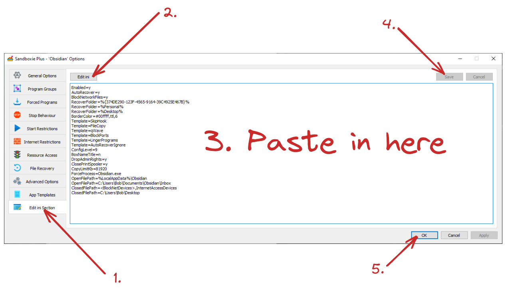

1. Download Sandboxie (Plus) from [here](https://sandboxie-plus.com/downloads/) (or [here](https://github.com/sandboxie-plus/Sandboxie/releases)).
2. Install it by running the .exe file. (It should ask for admin rights.)
3. Once open, create a "New Box";
	- ![[images/sandboxie-tut_Pasted-image-20220219164851.png]]
4. Choice your sandbox name; don't worry about the other settings;
5. Once your sandbox is created, open its settings. (Either double click or right-click and choose "Sandbox Options".)
6. Using this picture as reference paste & save the below 'ini' into your sandbox options, and make sure to change `<your-vault>` to the location of your vault.
	- 

(Note, I may update the ini from time to time. Consider checking back every so often.)

# ini
```
Enabled=y
AutoRecover=y
BlockNetworkFiles=y
RecoverFolder=%{374DE290-123F-4565-9164-39C4925E467B}%
RecoverFolder=%Personal%
RecoverFolder=%Desktop%
BorderColor=#00ffff,ttl,6
Template=SkipHook
Template=FileCopy
Template=qWave
Template=BlockPorts
Template=LingerPrograms
Template=AutoRecoverIgnore
Template=Chrome_Phishing_DirectAccess
Template=Firefox_Phishing_DirectAccess
ConfigLevel=9
BoxNameTitle=n
DropAdminRights=y
ClosePrintSpooler=y
CopyLimitKb=81920
ForceProcess=Obsidian.exe
OpenFilePath=%LocalAppData%\Obsidian
OpenFilePath=<your-vault>
ClosedFilePath=<BlockNetDevices>,InternetAccessDevices
```

# *Important*
Any applications launched from Obsidian (Firefox, File Explorer, etc) will be launched in the same sandbox. You made want to consider transferring the applications to the same sandbox, so your configurations stick.

Furthermore, keep in mind, this is a bare bones configuration! I hope to update it over time, but feel free contribute. I am not a Windows user.

# Optional
If you (monetarily) support the developer, you receive access to "privacy mode". If available, this is highly suggested. It simple adds a pseudo whitelist for the file system. I believe this should be the default, but I digress. Add `UsePrivacyMode=y` to enable the feature. (You will receive a warning message if you have no certificate!)

Alternatively, for free, you can create a custom blacklist for files/folder Obsidian should be denied access. This can be done in the 'Resource Restrictions' tab or by adding `ClosedFilePath=<your-file-path>` to your ini.
