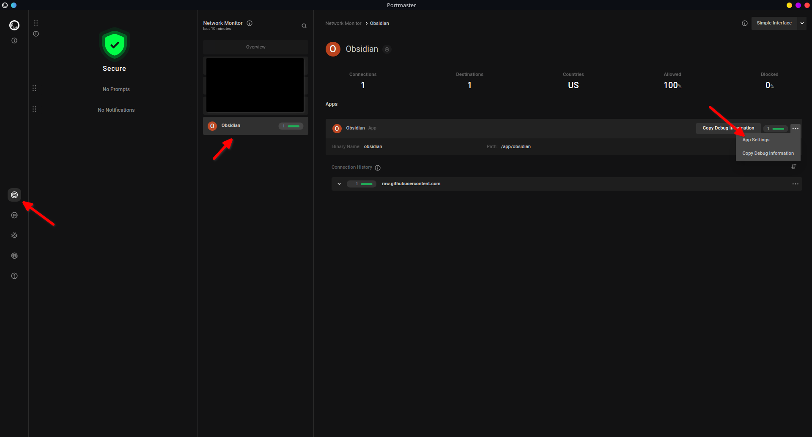
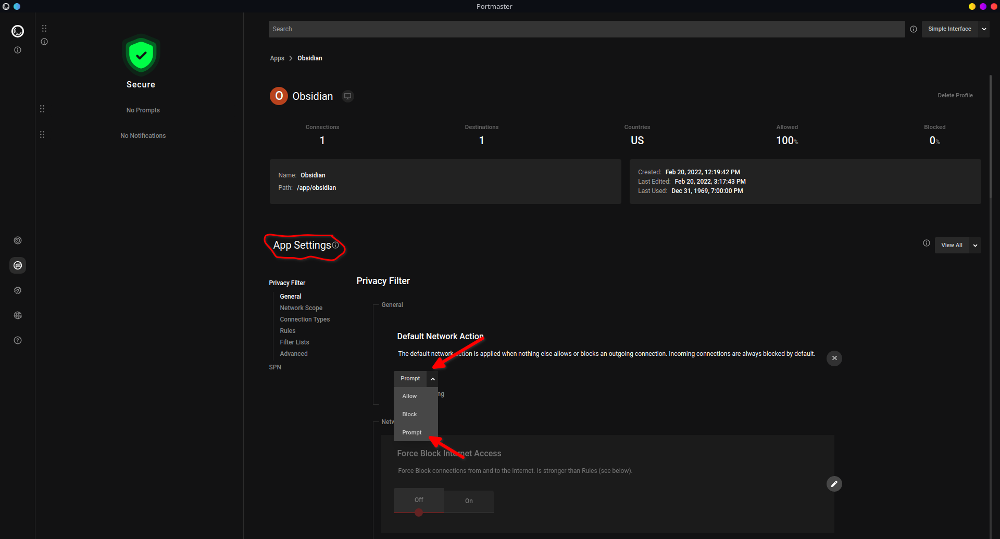
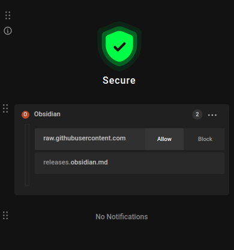

This tutorial shows you have to setup Portmaster in a whitelist mode for Obsidian. The same principles apply to any other application.

1. Follow the instructions found on it's [website](https://safing.io/portmaster/) to install Portmaster.
2. Go to "App Settings" as seen below.
    - 
3. By default it says, "Obsidian is fully using the global settings. Start creating exceptions for it now."; so, click edit settings.
4. As seen in the picture below, change the "Default Network Action" to "Prompt".
    - 
5. Now every request made by Obsidian will be blocked unless whitelist, and whenever a request (without a rule) gets blocked, you'll receive a notification like the one below.
    - 
6. For example, if you want to access the Community tabs in Obsidian, allow `raw.githubusercontent.com`. You shouldn't be asked again.
